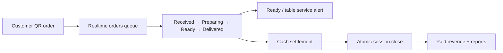

# King's Café · Manager & Cashier POS

Desktop-first operations console for managers, cashiers, and baristas. It receives table orders in real time, drives the drink lifecycle, handles cash settlement, and exposes operational reports without changing the customer-facing flow.


## Operating flow



## Highlights

- Cafe-scoped Supabase Auth, RLS, and realtime subscriptions.
- Server-enforced order/item state machine; terminal states cannot be edited.
- Optimistic order cache updates with rollback and targeted reconciliation.
- Cash-only settlement with server-calculated tax, service, received amount, and change.
- Cancelled items excluded from customer bills and revenue totals.
- Bilingual catalog labels: English and Arabic are entered independently; missing labels fall back safely without auto-translation.
- PDF report export, resilient product images, and menu/catalog realtime updates.

## Architecture

| Layer | Location | Responsibility |
|---|---|---|
| Routes | `src/app` | Dashboard, orders, products, reports, settings, auth |
| Domain | `src/features/**/domain` | Order states, cache rules, billing calculations |
| Application | `src/features/**/application` | Use cases and repository contracts |
| Infrastructure | `src/shared/infrastructure` | Supabase data sources, RPCs, realtime, storage |
| Presentation | `src/features/**/presentation` | Hooks and existing visual components |
| Database | `supabase` | RLS, atomic RPCs, state transitions, payments, realtime |

See the full system map in [`docs/architecture.md`](docs/architecture.md).

## Local setup

```bash
npm ci
copy .env.example .env.local
npm run dev
```

Required public variables:

```env
NEXT_PUBLIC_SUPABASE_URL=...
NEXT_PUBLIC_SUPABASE_ANON_KEY=...
NEXT_PUBLIC_CAFE_ID=...
```

Never commit `.env.local`, service-role keys, customer tokens, or generated `.next` output.

## Verification

```bash
npm run typecheck
npm run lint
npm test
npm run build
```

The end-to-end lifecycle is exercised from the customer repository with explicit disposable test credentials only.

## Related application

The customer QR ordering application lives in [`cofee_webApp`](https://github.com/ebrahimElsayd/cofee_webApp).
