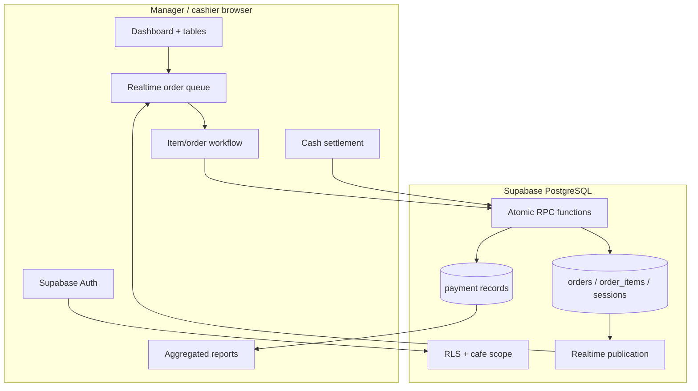

# Manager system map

```mermaid
flowchart TB
  subgraph POS[Manager / cashier browser]
    Auth[Supabase Auth]
    Dashboard[Dashboard + tables]
    Queue[Realtime order queue]
    Workflow[Item/order workflow]
    Payment[Cash settlement]
    Reports[Aggregated reports]
  end
  subgraph DB[Supabase PostgreSQL]
    RLS[RLS + cafe scope]
    RPC[Atomic RPC functions]
    Tables[(orders / order_items / sessions)]
    Payments[(payment records)]
    Pub[Realtime publication]
  end
  Auth --> RLS
  Dashboard --> Queue
  Queue --> Workflow
  Workflow --> RPC
  RPC --> Tables
  Payment --> RPC
  RPC --> Payments
  Tables --> Pub
  Pub --> Queue
  Payments --> Reports
```

Operational rule: the database is the final authority for state transitions, prices, payment totals, and session closure.
